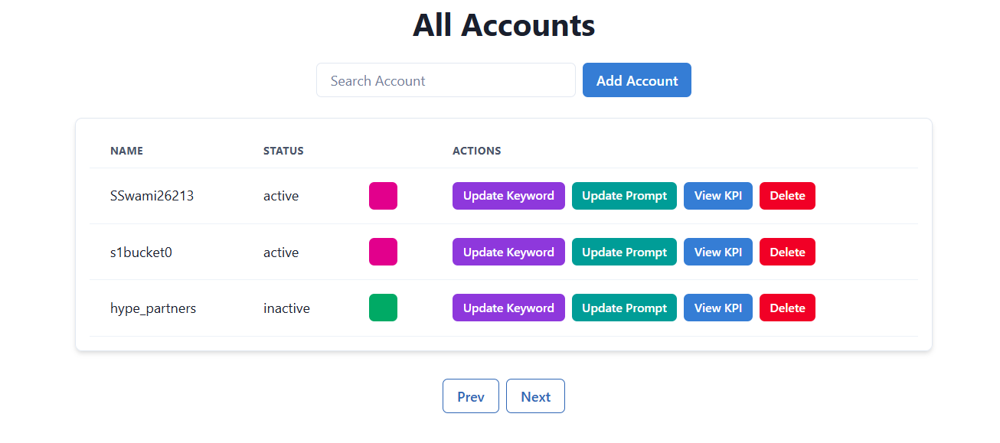

# Twitter Bot Management System
Bot to Reply on trending tweet(According to given keyword) using chat-gpt reply on the basis of tweet context and ui to manage multiple bots.




This project is a Flask-based application for managing Twitter bot accounts. It allows for adding, deleting, and updating Twitter accounts and their associated keywords and KPIs. The bot can be run to interact with Twitter based on the configured accounts and their settings.

## Features

- Add new Twitter accounts via OAuth
- Delete Twitter accounts
- Update account status (active/inactive)
- Update keywords and prompts for each account
- Update KPIs for each account
- Run the bot to perform automated tasks on Twitter

## Installation

### Prerequisites

- Python 3.x
- Flask
- Flask-CORS
- requests-oauthlib
> For most of the requirements follow download section

### Setup

1. **Clone the repository**:
   ```sh
   git clone https://github.com/yourusername/twitter-bot-management.git
   cd twitter-bot-management

2. **Create a virtual environment and activate it**:
   ```sh
   python -m venv my-env
   source my-env/bin/activate  # On Windows, use `venv\Scripts\activate`

3. **Install the required packages**:
   ```sh
   pip install -r requirements.txt

4. **Run the Flask application**:
   ```sh
   flask run


## API Endpoints

### General Endpoints
- **GET /**: Check if the system is working
- **GET /accounts**: Get all Twitter accounts
- **GET /runbot**: Run the bot

### Account Management
- **POST /account/<int:account_id>/deactivate**: Toggle account status (active/inactive)
- **DELETE /account/<int:account_id>**: Delete an account

### Keywords and Prompts
- **POST /keyword/<int:account_id>**: Update keywords for an account
- **POST /prompt/<int:account_id>**: Update prompt for an account

### KPIs
- **POST /kpi/<int:account_id>**: Update KPIs for an account

### Authentication
- **GET /login**: Initiate Twitter OAuth login
- **GET /callback**: Callback URL for Twitter OAuth

## Running the Bot

To manually run the bot, visit the `/runbot` endpoint. This will execute the bot logic defined in the `run` function from the `bot` module.
